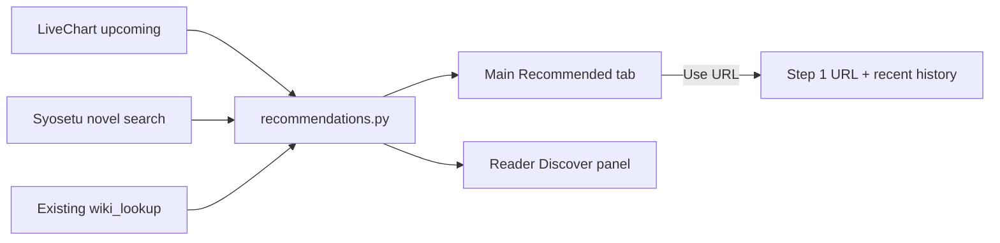

# Recommendations on main app and reader

## Goal
Help users find web novels from **upcoming anime** (LiveChart), with **cover art**, a **Syosetu URL** that fills Step 1, and **official release** notes. Same data powers:
- **Main app**: a Recommended browse list
- **Reader**: official release status for the open book + similar titles to check out

Web-novel links are **Syosetu-first** (`ncode.syosetu.com` / `novel18`) so one click can download. Non-Syosetu sources can be shown as text/links only.

## Architecture

## Backend: [`novel_translator/recommendations.py`](novel_translator/recommendations.py)
New module (reuse patterns from [`wiki_lookup.py`](novel_translator/wiki_lookup.py) `_Client` / 403 skip):

1. **Upcoming anime** from LiveChart  
   - Primary: `GET https://www.livechart.me/api/v1/charts/{season}/full_instances` with Android UA from public docs (`me.livechart.android/...`), category `tv`, sort `popularity`, modest `limit` (e.g. 24).  
   - Resolve current/next season slug via LiveChart nearest/season helpers or date-based `YYYY-spring` style slug.  
   - Fallback: parse HTML rankings page `release_status=not_yet_released` if API 403s.  
   - Extract per title: English/romaji title, poster URL, LiveChart page URL, premiere/status text.

2. **Web novel match**  
   - For each anime title, search Syosetu novel API (`api.syosetu.com/novelapi/api/` with `word=` / title keywords).  
   - Keep best hit when titles are related; expose `ncode` + full URL via existing `novel_page_url`.  
   - Mark `has_webnovel: true/false`.

3. **Official release**  
   - Call existing [`lookup_official`](novel_translator/wiki_lookup.py) / `enrich_official_names` for matched titles (light cache in `%USERPROFILE%\.novel_translator\recommendations_cache.json`, TTL ~12h so refresh is not hammering APIs).

4. **Public API for Bridge / Reader**
   - `list_upcoming(limit=12) -> list[dict]`  
   - `recommend_for_title(title, ncode="") -> dict` with `official`, `similar[]` (upcoming + Syosetu-related neighbors).

Each recommendation card payload:
- `title_en`, `title_jp`, `cover_url`, `livechart_url`
- `webnovel_url`, `ncode` (may be empty)
- `available[]`, `publishers[]`, `official_title`
- `premiere` / status blurb

## Main app UI
Files: [`ui/index.html`](ui/index.html), [`ui/app.js`](ui/app.js), [`ui/styles.css`](ui/styles.css), [`novel_translator/bridge.py`](novel_translator/bridge.py)

- Add library filter **Recommended** next to All / Author / Title / Finished.
- When selected, hide the normal book list and show a scrollable **recommendation grid**:
  - Cover image
  - English title (+ Japanese if known)
  - Official chips (Light novel / Manga / Anime, publishers)
  - **Use this URL** (fills `#url`, updates recent history, runs series refresh, switches filter back to All novels)
  - Link to LiveChart
- Bridge methods:
  - `recommendations()` → cached list + status text
  - `refresh_recommendations()` → background refresh, emit `recommendations` + progress status (“Loading upcoming anime…”, “Matching Syosetu…”)
- Rail or filter click triggers load; status bar shows progress (same `_status` pattern already used for download/lookup).

## Reader UI
File: [`novel_translator/reader.py`](novel_translator/reader.py) (+ thin hook from [`open_reader.py`](open_reader.py) if needed)

- Replace the single “Chapters” sidebar with a small tab strip: **Chapters** | **Discover**.
- **Discover** panel for the open EPUB:
  - **Official releases** for the current book title (reuse `lookup_official` / cached `official.json` if ncode can be inferred from path/`books/<ncode>/`).
  - **Similar / upcoming** cards (cover + title + “has Syosetu” badge). Reader cannot drive the main URL field, so cards open the LiveChart/Syosetu URL in the system browser, and show copyable ncode/URL text.
- Load Discover lazily on first tab open so opening a book stays fast.

## Caching and failure behavior
- Cache LiveChart + enrichment under `~/.novel_translator/recommendations_cache.json`.
- If LiveChart is blocked (403), status explains it and still show any cache; Syosetu/wiki enrichment still runs for titles already cached.
- Do not hardcode series names; matching is search-based only.

## Out of scope for this pass
- Auto-download from a recommendation (user still confirms range / keep-update).
- Full Kakuyomu download support (show non-Syosetu links as external only if found later).
- Changing the Translate pipeline.
